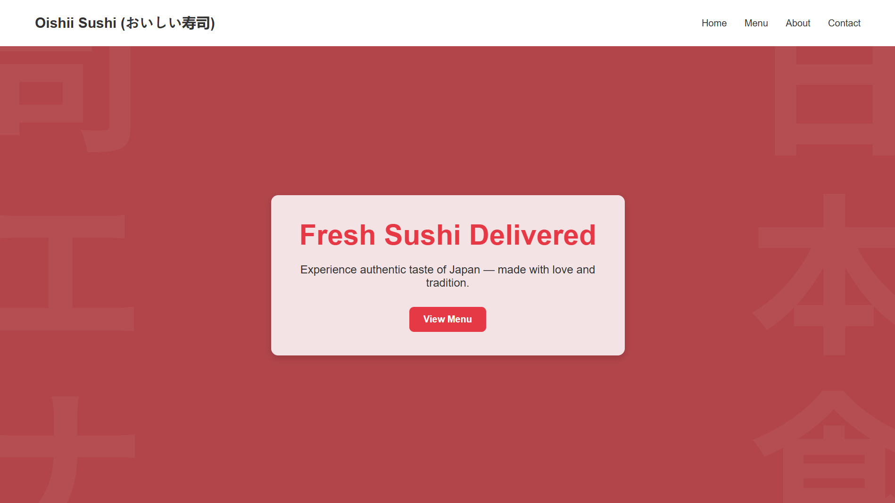

# oishii-sushi-website-
# 🍣 Oishii Sushi (おいしい寿司)

A clean sushi-themed Japanese restaurant website built using only HTML and CSS. This project reflects a traditional yet modern dining experience with a focus on simplicity and elegance.

## 📸 Preview

 

## 🌟 Features

- Hero section with heading 
- Japanese menu section with styled cards
- About Us and Testimonials sections
- Custom fonts and consistent theme
- Smooth hover effects & media queries

## 🧠 What I Learned

- Designing consistent themes based on culture/style
- Structuring multipage-like websites using sections

## 🛠️ Built With

- HTML5  
- CSS3 (Flexbox, Google Fonts)

